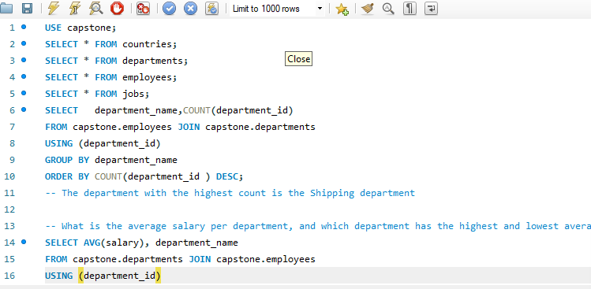

# Orion-Data-Systems-Workforce-Analytics

## **Executive Summary**
In any data-driven organization, payroll and human capital represent both the largest operational investment and the primary driver of strategic execution. This analysis utilizes structured database architecture to evaluate the workforce distribution, compensation equity, and operational footprint of the company.

## **Business Context**
Orion Data Systems is a major multinational consulting and technology firm. It is headquartered in San Francisco, USA, but has a global footprint with offices spread across Europe, Asia, and the Americas.The company employs a massive workforce spanning numerous departments, job roles, and geographic locations. Managing and optimizing this workforce requires data-driven decision-making.Essentially, Orion Data Systems is using this analytics project to transition from reactive HR management to proactive workforce planning.

## **Objectives**
This report addresses the following key questions:
- To segment the entire workforce into distinct tier-based compensation brackets (Low, Medium, and High) and determine the headcount within each tier:
- To aggregate and rank total salary expenditures across each operating country, ordered from the highest financial commitment to the lowest.
-To identify all job roles in the company (jobs table) that currently have no employees assigned.

## **Data Overview**
The insights in this report were derived by querying and cross-referencing core organizational tables, including the countries, employees and departments datasets.

## **Data Preview**

## **Detailed Findings & Analysis**
### **Key Performance Indicators**
- **Department Headcount**: The Shipping department holds the highest employee headcount across the organization.  
- **Compensation Extremes**: The Executive unit commands the highest average salary, whereas the Shipping department records the lowest average salary.
- **Salary Bracket Distribution**: An analysis of workforce compensation tiers reveals that 49 employees fall into the low salary band, 43 occupy the medium band, and 15 are positioned in the high salary band.
- **Workforce Gaps**: The analysis indicates optimal role utilization across the company, confirming there are no job roles that currently have zero employees assigned to them.
- **Geographic Labor Costs**: Looking at regional spending trends, Switzerland represents the highest labor cost at 75,100, followed by Italy at 52,100, while the United Kingdom records the lowest total salary expense at 2,200.

## **Recommendations**
- The Shipping department represents the company’s highest headcount but yields the lowest average salary. This often points to a high-volume, labor-intensive operational structure with low individual profit margins per capita.Management should conduct a workforce efficiency audit within the Shipping department. Explore process automation or digital workflow optimizations to ensure this large headcount is operating at peak productivity without unnecessary overhead costs.
- For future project scaling or technical support hiring, consider expanding operations within the United Kingdom, where current labor costs are significantly lower, allowing for a more cost-effective regional scale-up.

## **Tools Used**
- **SQL**: Data analysis

## **Conclusion**
In summary, this capstone project successfully meets both its organizational and professional objectives. For Orion Data Systems, it provides the HR & Strategy team with the empirical clarity required to optimize departmental budgets, audit international labor costs, and streamline resource allocation.
